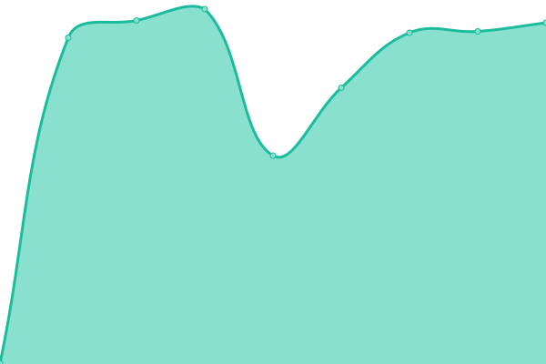
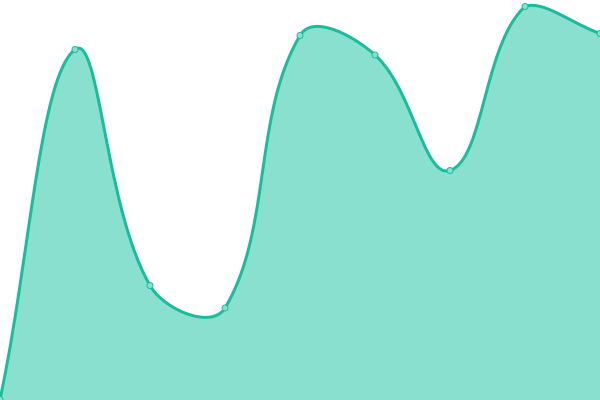
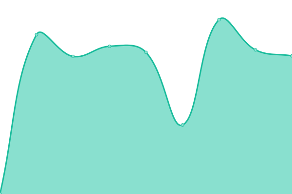
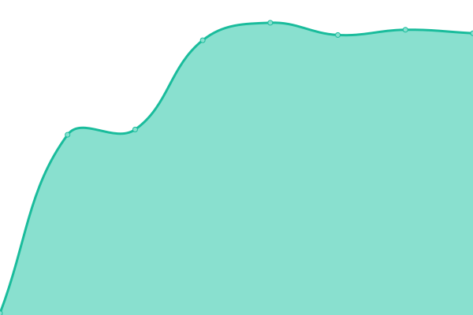
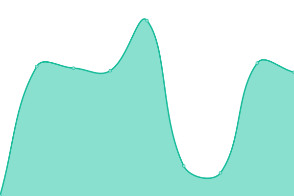
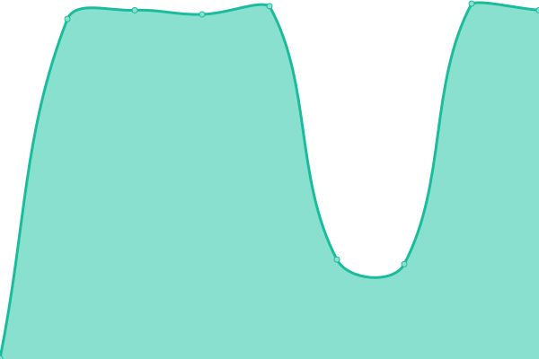

# [📈 Live Status](https://OwlTing.github.io/upptime): <!--live status--> **🟩 All systems operational**

This repository contains the open-source uptime monitor and status page for [OwlTing](https://OwlTing.github.io/upptime), powered by [Upptime](https://github.com/upptime/upptime).

With [Upptime](https://upptime.js.org), you can get your own unlimited and free uptime monitor and status page, powered entirely by a GitHub repository. We use [Issues](https://github.com/OwlTing/upptime/issues) as incident reports, [Actions](https://github.com/OwlTing/upptime/actions) as uptime monitors, and [Pages](https://OwlTing.github.io/upptime) for the status page.

<!--start: status pages-->
<!-- This summary is generated by Upptime (https://github.com/upptime/upptime) -->
<!-- Do not edit this manually, your changes will be overwritten -->
<!-- prettier-ignore -->
| URL | Status | History | Response Time | Uptime |
| --- | ------ | ------- | ------------- | ------ |
|  [Owlting Market](https://www.owlting.com/market) | 🟩 Up | [owlting-market.yml](https://github.com/OwlTing/upptime/commits/HEAD/history/owlting-market.yml) | 

 1601ms
     
 | 

<a href="https://OwlTing.github.io/upptime/history/owlting-market">100.00%</a>
    

|  [Owlnest Booking Engine](https://booking.owlting.com) | 🟩 Up | [owlnest-booking-engine.yml](https://github.com/OwlTing/upptime/commits/HEAD/history/owlnest-booking-engine.yml) | 

 664ms
     
 | 

<a href="https://OwlTing.github.io/upptime/history/owlnest-booking-engine">100.00%</a>
    

|  [Owlnest API](https://api.owlting.com/booking/admin/version) | 🟩 Up | [owlnest-api.yml](https://github.com/OwlTing/upptime/commits/HEAD/history/owlnest-api.yml) | 

 1432ms
     
 | 

<a href="https://OwlTing.github.io/upptime/history/owlnest-api">100.00%</a>
    

|  [Owlting Experiences](https://www.owlting.com/experiences) | 🟩 Up | [owlting-experiences.yml](https://github.com/OwlTing/upptime/commits/HEAD/history/owlting-experiences.yml) | 

 941ms
     
 | 

<a href="https://OwlTing.github.io/upptime/history/owlting-experiences">100.00%</a>
    

|  [Owljourney](https://www.owlting.com/owljourney) | 🟩 Up | [owljourney.yml](https://github.com/OwlTing/upptime/commits/HEAD/history/owljourney.yml) | 

 144ms
     
 | 

<a href="https://OwlTing.github.io/upptime/history/owljourney">100.00%</a>
    

|  [Owlnews](https://www.owlting.com/news) | 🟩 Up | [owlnews.yml](https://github.com/OwlTing/upptime/commits/HEAD/history/owlnews.yml) | 

 1186ms
     
 | 

<a href="https://OwlTing.github.io/upptime/history/owlnews">100.00%</a>
    

|  [Owlting NFT](https://nft.owlting.com/api/tokens/69) | 🟩 Up | [owlting-nft.yml](https://github.com/OwlTing/upptime/commits/HEAD/history/owlting-nft.yml) | 

 965ms
     
 | 

<a href="https://OwlTing.github.io/upptime/history/owlting-nft">100.00%</a>
    

|  [Owlting Portal](https://www.owlting.com/portal) | 🟩 Up | [owlting-portal.yml](https://github.com/OwlTing/upptime/commits/HEAD/history/owlting-portal.yml) | 

 838ms
     
 | 

<a href="https://OwlTing.github.io/upptime/history/owlting-portal">100.00%</a>
    

|  [Owlpay Portal](https://owlpay.com) | 🟩 Up | [owlpay-portal.yml](https://github.com/OwlTing/upptime/commits/HEAD/history/owlpay-portal.yml) | 

 643ms
     
 | 

<a href="https://OwlTing.github.io/upptime/history/owlpay-portal">100.00%</a>
    

<!--end: status pages-->

[**Visit our status website →**](https://OwlTing.github.io/upptime)

## 📄 License

- Powered by: [Upptime](https://github.com/upptime/upptime)
- Code: [MIT](./LICENSE) © [OwlTing](https://OwlTing.github.io/upptime)
- Data in the `./history` directory: [Open Database License](https://opendatacommons.org/licenses/odbl/1-0/)
