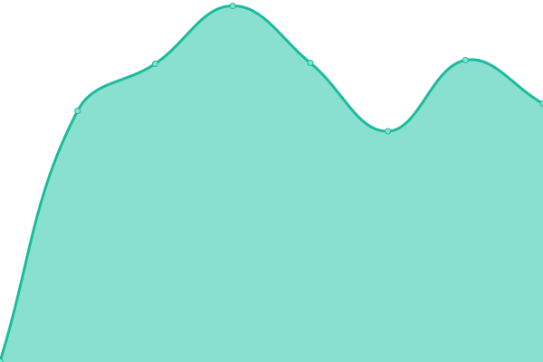
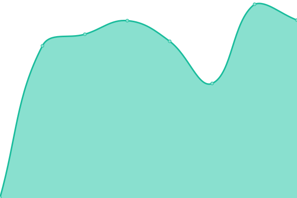

# [📈 Live Status](https://OwlTing.github.io/upptime): <!--live status--> **🟩 All systems operational**

This repository contains the open-source uptime monitor and status page for [OwlTing](https://OwlTing.github.io/upptime), powered by [Upptime](https://github.com/upptime/upptime).

With [Upptime](https://upptime.js.org), you can get your own unlimited and free uptime monitor and status page, powered entirely by a GitHub repository. We use [Issues](https://github.com/OwlTing/upptime/issues) as incident reports, [Actions](https://github.com/OwlTing/upptime/actions) as uptime monitors, and [Pages](https://OwlTing.github.io/upptime) for the status page.

<!--start: status pages-->
<!-- This summary is generated by Upptime (https://github.com/upptime/upptime) -->
<!-- Do not edit this manually, your changes will be overwritten -->
<!-- prettier-ignore -->
| URL | Status | History | Response Time | Uptime |
| --- | ------ | ------- | ------------- | ------ |
|  [OwlNest - API](https://api.owlting.com/booking/services/alive) | 🟩 Up | [owl-nest-api.yml](https://github.com/OwlTing/upptime/commits/HEAD/history/owl-nest-api.yml) | 

 763ms
     
 | 

<a href="https://OwlTing.github.io/upptime/history/owl-nest-api">100.00%</a>
    

|  [OwlNest - Booking Engine](https://booking.owlting.com/this-is-owlting) | 🟩 Up | [owl-nest-booking-engine.yml](https://github.com/OwlTing/upptime/commits/HEAD/history/owl-nest-booking-engine.yml) | 

 761ms
     
 | 

<a href="https://OwlTing.github.io/upptime/history/owl-nest-booking-engine">100.00%</a>
    

|  [OwlJourney](https://www.owlting.com/owljourney) | 🟩 Up | [owl-journey.yml](https://github.com/OwlTing/upptime/commits/HEAD/history/owl-journey.yml) | 

 1380ms
     
 | 

<a href="https://OwlTing.github.io/upptime/history/owl-journey">99.79%</a>
    

|  [OwlTing Market](https://www.owlting.com/market) | 🟩 Up | [owl-ting-market.yml](https://github.com/OwlTing/upptime/commits/HEAD/history/owl-ting-market.yml) | 

 1313ms
     
 | 

<a href="https://OwlTing.github.io/upptime/history/owl-ting-market">100.00%</a>
    

|  [OwlTing Experiences](https://www.owlting.com/experiences) | 🟩 Up | [owl-ting-experiences.yml](https://github.com/OwlTing/upptime/commits/HEAD/history/owl-ting-experiences.yml) | 

 2396ms
     
 | 

<a href="https://OwlTing.github.io/upptime/history/owl-ting-experiences">98.70%</a>
    

|  [OwlNews](https://www.owlting.com/news) | 🟩 Up | [owl-news.yml](https://github.com/OwlTing/upptime/commits/HEAD/history/owl-news.yml) | 

 2330ms
     
 | 

<a href="https://OwlTing.github.io/upptime/history/owl-news">100.00%</a>
    

|  [OwlTing NFT](https://nft.owlting.com/api/tokens/69) | 🟩 Up | [owl-ting-nft.yml](https://github.com/OwlTing/upptime/commits/HEAD/history/owl-ting-nft.yml) | 

 844ms
     
 | 

<a href="https://OwlTing.github.io/upptime/history/owl-ting-nft">100.00%</a>
    

|  [OwlTing Portal](https://www.owlting.com/portal) | 🟩 Up | [owl-ting-portal.yml](https://github.com/OwlTing/upptime/commits/HEAD/history/owl-ting-portal.yml) | 

 857ms
     
 | 

<a href="https://OwlTing.github.io/upptime/history/owl-ting-portal">100.00%</a>
    

|  [OwlPay Portal](https://owlpay.com) | 🟩 Up | [owl-pay-portal.yml](https://github.com/OwlTing/upptime/commits/HEAD/history/owl-pay-portal.yml) | 

 2955ms
     
 | 

<a href="https://OwlTing.github.io/upptime/history/owl-pay-portal">100.00%</a>
    

|  [OwlTing AML](https://aml.owlpay.com/v1/health) | 🟩 Up | [owl-ting-aml.yml](https://github.com/OwlTing/upptime/commits/HEAD/history/owl-ting-aml.yml) | 

 579ms
     
 | 

<a href="https://OwlTing.github.io/upptime/history/owl-ting-aml">100.00%</a>
    

|  [OBS Portal](https://www.owlting.com/obs/) | 🟩 Up | [obs-portal.yml](https://github.com/OwlTing/upptime/commits/HEAD/history/obs-portal.yml) | 

 861ms
     
 | 

<a href="https://OwlTing.github.io/upptime/history/obs-portal">100.00%</a>
    

|  [OwlTing Blog](https://blog.owlting.com/) | 🟩 Up | [owl-ting-blog.yml](https://github.com/OwlTing/upptime/commits/HEAD/history/owl-ting-blog.yml) | 

 5064ms
     
 | 

<a href="https://OwlTing.github.io/upptime/history/owl-ting-blog">99.83%</a>
    

|  [OwlMap](https://api.owlting.com/owlmap/health) | 🟩 Up | [owl-map.yml](https://github.com/OwlTing/upptime/commits/HEAD/history/owl-map.yml) | 

 651ms
     
 | 

<a href="https://OwlTing.github.io/upptime/history/owl-map">100.00%</a>
    

<!--end: status pages-->

[**Visit our status website →**](https://OwlTing.github.io/upptime)

## 📄 License

- Powered by: [Upptime](https://github.com/upptime/upptime)
- Code: [MIT](./LICENSE) © [OwlTing](https://OwlTing.github.io/upptime)
- Data in the `./history` directory: [Open Database License](https://opendatacommons.org/licenses/odbl/1-0/)
